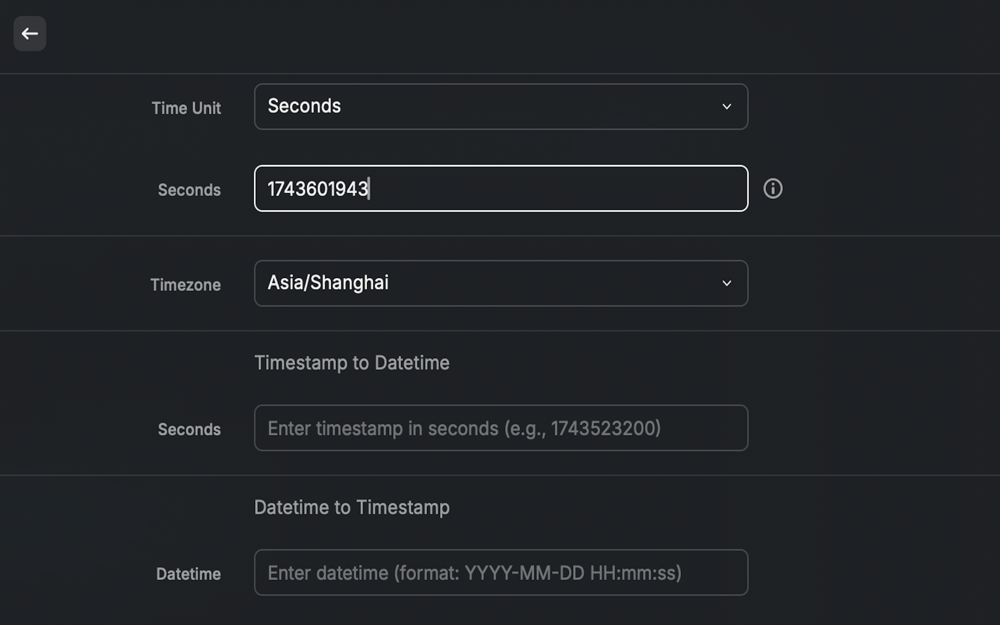

# Timestamp Converter

A powerful and user-friendly tool for converting between Unix timestamps and human-readable datetime formats.

## Features

- Real-time current timestamp display (updates every second)
- Support both seconds and milliseconds timestamp formats
- Bidirectional conversion between timestamp and datetime
- Support for 30+ major timezones worldwide
- Convenient keyboard shortcuts
  - `⌘ + Enter`: Copy conversion result and close window
  - `⌘ + ⇧ + C`: Copy current timestamp

## Screenshots

The main interface provides a clean and intuitive layout:
- Real-time current timestamp at the top
- Time unit selection (seconds/milliseconds)
- Timezone dropdown with 30+ options
- Bidirectional conversion between timestamp and datetime
- Clear result display with copy functionality

## Usage

1. View Current Timestamp
   - The current timestamp is displayed and updated in real-time
   - Choose between seconds or milliseconds format
   - Use `⌘ + ⇧ + C` to quickly copy

2. Convert Timestamp to Datetime
   - Enter a Unix timestamp
   - Select your desired timezone
   - The converted datetime will be displayed instantly
   - Use `⌘ + Enter` to copy the result and close window

3. Convert Datetime to Timestamp
   - Enter a datetime (format: YYYY-MM-DD HH:mm:ss)
   - Select your timezone
   - Get the corresponding Unix timestamp
   - Use `⌘ + Enter` to copy the result and close window

## Why This Extension?

This extension streamlines the process of working with timestamps, making it an essential tool for:
- Developers debugging time-related issues
- DevOps engineers analyzing logs
- Anyone working with Unix timestamps in their daily workflow

The combination of real-time updates, multiple timezone support, and convenient keyboard shortcuts makes timestamp conversion quick and effortless.